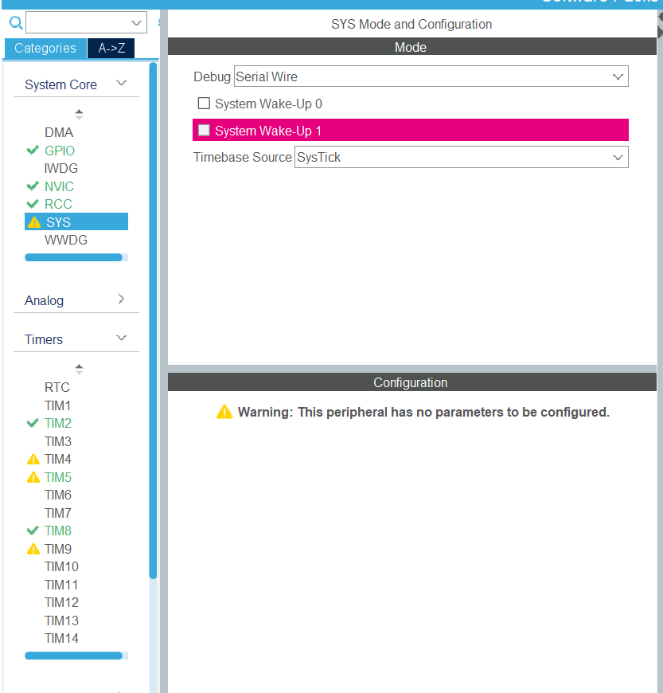
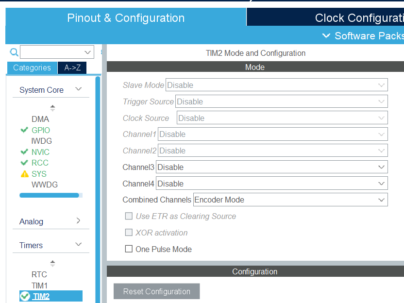
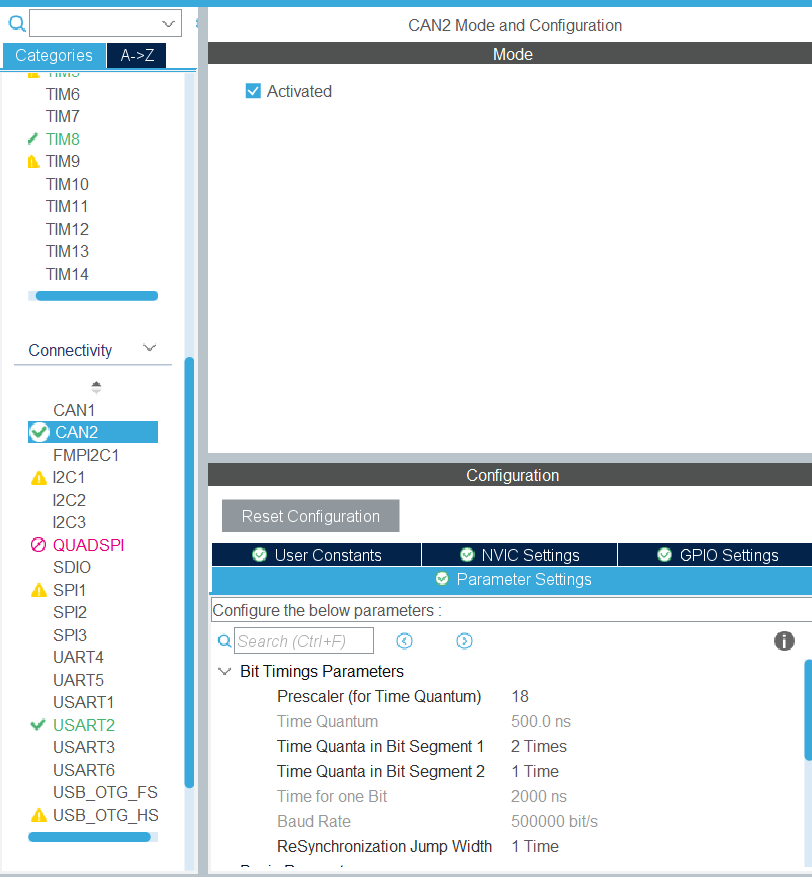
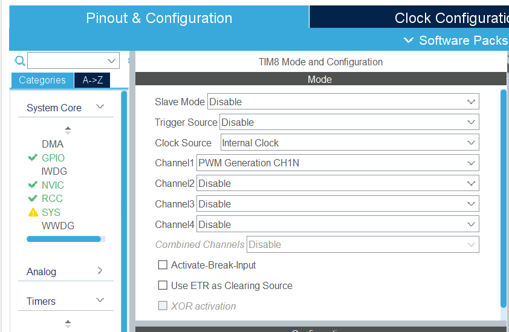
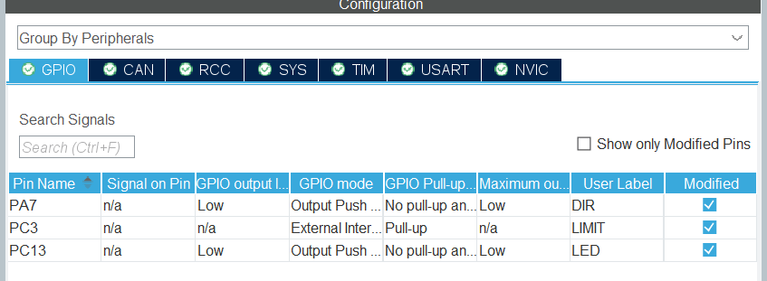
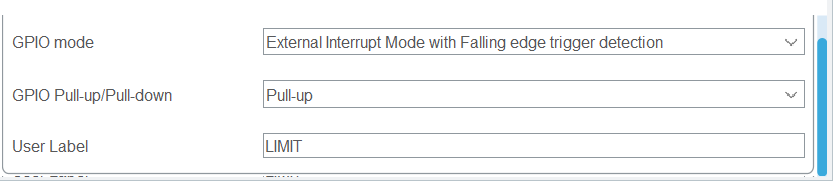
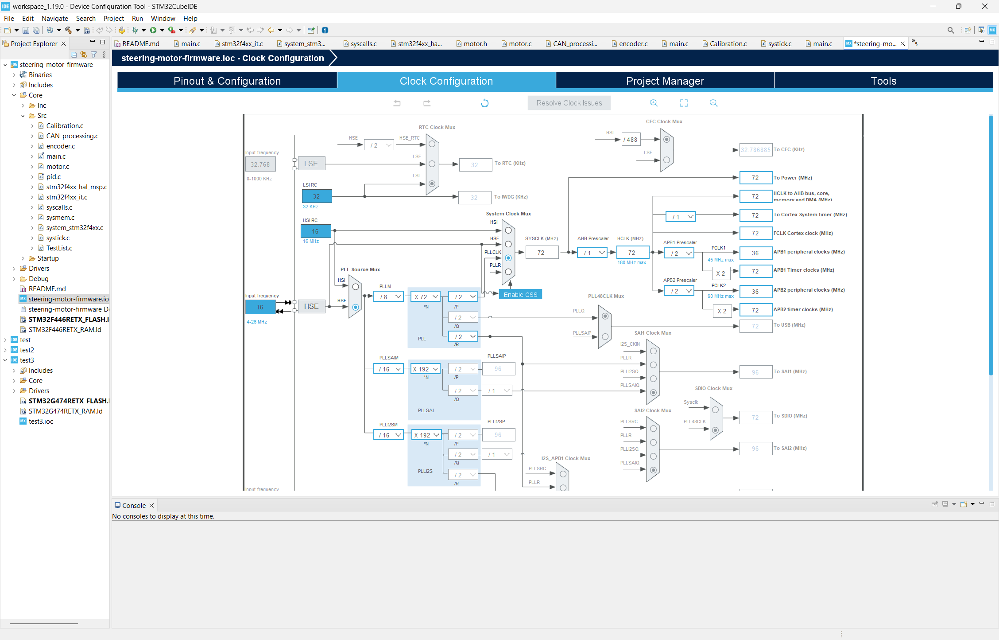
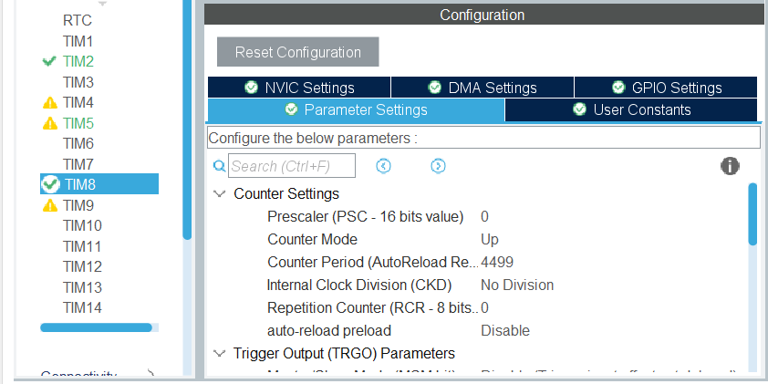
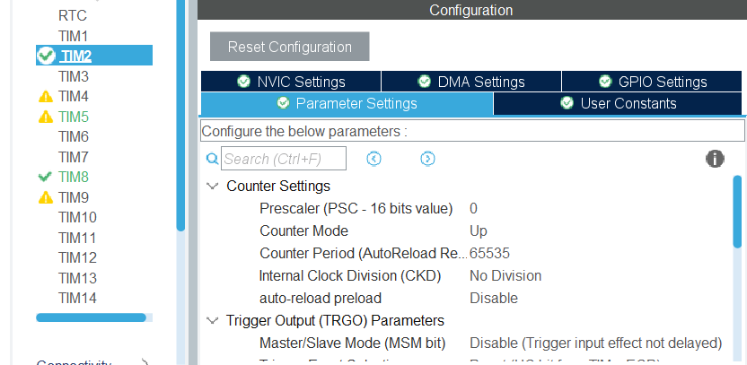

# steering-motor-firmware

## STM32 .ioc setup

The firmware requires a `LIMIT` pin for the limit switch setup for interrupt use
with `GPIO_EXTI3`, a `LED` pin setup as a `GPIO_Output`, a CAN peripheral (CAN2_RX and CAN2_TX), debug as Serial Wire, a pin for PWM with usage `TIM8_CH1N`, a DIR pin as `GPIO_Output` and 2 pins setup as a timer in encoder mode (`TIM2_CH1` and `TIM2_CH2` in encoder mode)

**Debug setup**

**Encoder setup**

**CAN setup**

**PWM setup**

**GPIO setup**

Additionally the LIMIT pin should have the GPIO pull up resistor enabled

The clock setup requires to set the HSE source to be 16MHz to match the crystal
we are using and for the system clock to be generated from the PLLCLK which is itself generated from HSE.

## Basic motor control

The motors are controlled through a motor driver IC (DRV8874PWPR) which can be controlled through a direction pin and a pwm pin for the motor speed.

Controlling direction is simply done by setting a pin to logic high for one direction and logic low for the other. The direction that the motor will spin (counterclockwise or clockwise) depends on this but also depends on the polarity of the wiring which is why the direction in the code is simply denoted by `1` and `0`. (see `set_motor_direction` function in `motor.h`)

Controlling the motor speed is done through a pwm signal. This is done in stm32 cube ide by configuring a pin to have its output to be controlled by a timer. We then set up the timer to count up to 4499 which allows is 4500 levels for our speed control. This was done to have a high level of precision over the speed of the motor but also to avoid too low of a frequency which would cause excessive heating of the motor alongside audible noise.

To set the max value of the pwm timer we set the counter period in the `.ioc` to 4499 for timer `TIM8` and channel `CH1N` with a prescaler of 0. To obtain the pwm frequency we can calculate it as F_clk/((ARR+1)(PSC+1)) where ARR is the value of the counter period, PSC is the prescaler and F_clk is the frequency of the clock driving the timer. In our case the Timer clock was setup in the clock configuration of the `.ioc` to be 72MHz.

Power control can be done using `set_motor_speed_percent` which will take a number from 0 to 100 which represents a percent of the maximum power defined in `power_limit`. It can also be done using `set_motor_speed_raw` which takes the value to be given to the pwm timer by setting the timer's CCR register (in our case `TIM8 -> CCR1`). If the values is above the max value defined in `power_limit` it is clamped. If a negative value is given then the absolute value will be used. Once the raw value is given to the pwm timer it creates a signal with a duty cycle of CCR/ARR where ARR is the counter period (or max value that the timer can count to) and CCR is a value <= ARR stored in the CCR register for the pwm timer channel.

Stopping a motor is done by setting the motor power to 0 and setting the target for the PID loop to the current encoder count value (This prevents the PID loop from overriding the motor power setting)

## Encoder

The encoders are setup using the stm32's builtin timer encoder mode on `TIM2` (see setup in `.ioc` file). This mode configures 2 pins on the stm to be attached to the encoder. The stm32 automatically counts up whenever the encoder sends data to the board. We then fetch the count value of the encoder using `set_counts` in `encoder.c` every millisecond in using the systick function (see PID section). 

**Setup for the encoder counts timer**

`encoder.c` also handles conversions between angle values and count values.

The encoder counts are to mapped to degrees as a linear range.

0 degrees is not mapped to 0 degrees in counts to avoid wrap around which causes instability when moving the motor to 0 degrees. This is implemented by setting the reset value (at the 180 degrees point) when the limit switch is triggered to 50000 even though the motor will only have 33024 counts for a full rotation.

To convert from angle to counts we convert angles to a range between 0 and 360 using modulo then adds an offset. The offset is calculated as `(LIMIT_SWITCH_RESET_COUNTS-MAX_COUNTS/2);` where `MAX_COUNTS` corresponds to 360 degrees in counts and `LIMIT_SWITCH_RESET_COUNTS` corrresponds to the 180 degrees point. By substracting `MAX_COUNTS/2` we substract 180 degrees in counts to obtain the 0 degrees point which is the offset.

To convert from counts to angle the offset (0 degree in counts) is substracted from the counts value. Then we divide by `MAX_COUNTS` and multiply by 360 to obtain the angle in degrees.

## PID

The PID Loop is implemented using the systick timer.
In `stm32f4xx_it.c` The function SysTick_Handler is used to use the systick timer and calles the function `SysTickFunction` which processes our PID loop every ms.

`SysTickFunction` in `systick.c` runs the PID code and updates the code with the current encoder value that is automatically updated by the stm32 encoder mode.

PID is setup using 4 parameters found in `pid.h`.

`kPw` and `kdW` are the constants for PID control.  

`ALLOWED_ERROR` controls the deadzone around the target angle.

`setPIDGoalA` is used to set the variable `goalAngle` which is the target of the PID loop in normal operation.

The PID loop calculates the difference in counts between the current position and that target position `goal` which is obtained as an argument to `updatePIDImpl`. The absolute value of the difference is clamped between 0 and 4999 (maximum value for pwm) to control the motor speed. The sign of the difference is used to control if the motor spins clockwise or counterclockwise

In normal operation PID is operated using `updatePID` which uses passes the `goalAngle` variable to `updatePIDImpl`.

In other modes of operation the PID goal can be overriden by using other functions than `updatePID` and passing different targets as goal. (See limit switch section)

It is important to coordinate the direction chosen in `pid.c` and the encoder counting direction as the code will not automatically choose if they match

## Calibration/Limit Switches

The calibration sequence is controlled by `steering_state` in `calibration.c`. Starting calibration sets that variable to `CALIBRATION`. 
Once the PID loop will be disabled and instead the motor will be set to turn at a slow speed in towards the limit switch (using `set_calibration_motor_movement`). 
Once the limit switch is triggered via an interrupt (see `HAL_GPIO_EXTI_Callback` in `main.c`), it starts polling using the systick to debounce the switch by filling a buffer (see `try_calibrate_encoder`, `scan_switch` and `is_debouncing`/`set_debouncing` in `encoder.c`). 
If the buffer is filled with `1`s then the limit switch will be considered pressed.

When it is calibrated, both the counts variable used for PID and the automatically updated count register will be set to `LIMIT_SWITCH_RESET_COUNTS` which corresponds to 180 degrees in counts (currently required to be 180 degrees due to the count to encoder conversion code).

If the limit switch was triggered by the calibration sequence the motor will then also set the `goalAngle` for PID to 90 degrees to reset the wheels to be straight.

Otherwise in normal operation when the limit switch is triggered it moves to a fixed point (currently hardcoded to 170 degrees). To do this instead of calling `updatePID`, `leave_limit_switch` is used instead. In `leave_limit_switch` the PID loop is called with an override target degrees (170) instead of the normal `goalAngle`. If the PID control function returns `true` that means it has reached its goal so when that happens `leave_limit_switch` will move back to the normal `steering_state` of `PID`. If the goal was set to be larger than 170 degrees the motor will be stopped so it does not keep triggering the limit switch.

## CAN

The CAN interface used for steering is similar to the one used on drive but with control being done with position instead of speed.

The CAN interface for controlling the motors is done through the ID of the CAN messages. This requires us to setup the filter on the CAN peripheral of the STM32 to accept all incoming connections.

As we wired the CAN transceiver to the CAN2 peripheral on the STM32 it was necessary to set the SLAVEFILTERBANK to be 14 as the alues 0 to 1 are set to go to CAN1

As all messages are accepted, the firmware filters the messages intended for a specific motor based on some bits in the packet id.

Specifying which motor the board controls is done in `motor.c` with an enum with the following values: `RF_STEER`,`LF_STEER`,`RB_STEER`,`RB_STEER`

When a message is received the function `HAL_CAN_RxFiFo0MsgPendingCallback` will be called and it will empty all pending messages as we only want the last message then we set the `datacheck` variable to 1 so we know a message has been received. Then in the main loop we check `datacheck` to process the message using `CAN_PARSE_MSG` and then reset datacheck to 0. 

> Note: if `steering_state` is `CALIBRATION` all CAN messages are ignored

After a message is processed, the functions in pid.h or motor.h are used to control the motor. For a new angle command `setPIDGoalA` is used. For stopping the motor `stop_motor` in `motor.c` is used. To read the current angle we use `count_to_angle` with `get_counts` and then send it back using `sendCANResponse`.

## Remaining issues

 - Limit switch continues to trigger randomly even when it is not supposed 
 to be active (we should see if it can be fixed with more aggressive 
 debouncing)